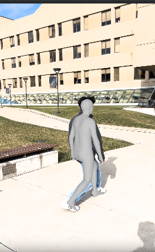
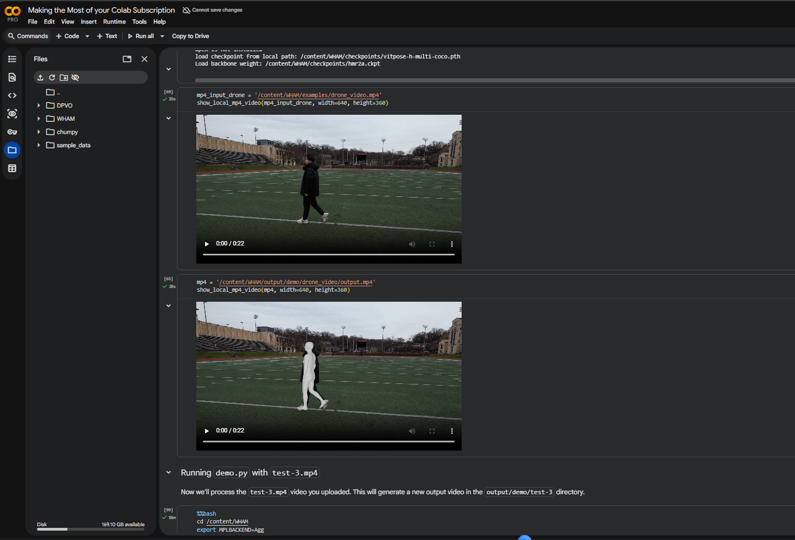
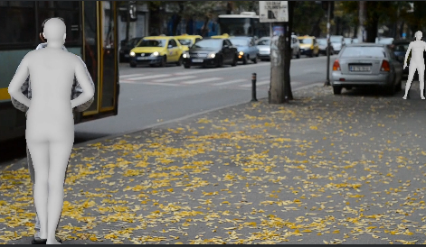

Here's the cleaned-up README you can copy and paste directly:

---

```markdown
# CS_547_WHAM_keesarg_pakeerm

This repository is a **fork created for the CS 547 Final Research Project at SUNY Polytechnic Institute**, based on the official WHAM repository.

- **Original Repository:** https://github.com/yohanshin/WHAM
- **Paper:** WHAM: Reconstructing World-grounded Humans with Accurate 3D Motion (CVPR 2024)
- **arXiv:** https://arxiv.org/abs/2312.07531

---

## Team Members

- Godha Harshitha Keesari
- Mineesha Pakeer

---

## Project Objective

The goal of this project is to reproduce and analyze the WHAM framework for monocular 3D human motion reconstruction.

WHAM estimates temporally consistent 3D human motion and body mesh from a single RGB video using:

- ViTPose (2D keypoint detection)
- Feature extraction backbone
- SMPL body model
- Temporal motion modeling
- DPVO / SLAM camera motion estimation

This repository is used for:

- **Experiment 1:** Replication of original paper results
- **Experiment 2:** Modified experiments / new data testing

---

## Modifications Made to Original Repository

The following practical changes were made for this CS 547 project:

- Added Colab setup for demo execution
- Added Linux GPU setup for benchmark evaluation
- Added experiment scripts and benchmark notes
- Added Penn Action dataset workflow
- Added project documentation and results

> **Note:** The original WHAM Colab environment was not directly reproducible in the current runtime, so a clean custom environment was created manually.

---

## Environment Setup

### A. Colab Setup — WHAM Demo / Local Coordinate Mode

Used for demo inference **without DPVO**.

**Recommended:** Tesla T4, Google Colab, Linux  
**Stack:** Python 3.9 · PyTorch 1.11 · CUDA 11.3 · NumPy 1.23.5

```bash
wget https://repo.anaconda.com/miniconda/Miniconda3-latest-Linux-x86_64.sh
bash Miniconda3-latest-Linux-x86_64.sh -b -p /usr/local/miniconda

/usr/local/miniconda/bin/conda create -n wham python=3.9 -y

export MPLBACKEND=Agg
export PYTHONPATH=/content/WHAM/third-party/ViTPose:/content/WHAM

cd /content/WHAM
```

Example run:

```bash
/usr/local/miniconda/envs/wham/bin/python demo.py \
  --video examples/IMG_9732.mov \
  --visualize \
  --estimate_local_only
```

---

### B. Linux Workstation Setup — Benchmarks + DPVO

**Recommended:** Python 3.9 · CUDA GPU · Conda environment

```bash
source "$HOME/miniconda3/bin/activate" wham_dpvo
export PYTHONPATH=$PWD/third-party/DPVO:$PWD/third-party/ViTPose:$PYTHONPATH
```

---

## Running Experiments

### Experiment 1 — Benchmark Evaluation

**EMDB Split 1**

```bash
python lib/eval/evaluate_emdb.py \
  -c configs/yamls/demo.yaml \
  --eval-set emdb \
  --eval-split 1
```

**EMDB Split 2**

```bash
python lib/eval/evaluate_emdb.py \
  -c configs/yamls/demo.yaml \
  --eval-set emdb \
  --eval-split 2
```

**RICH**

```bash
python -m lib.eval.evaluate_rich \
  --cfg configs/yamls/demo.yaml \
  TRAIN.CHECKPOINT checkpoints/wham_vit_w_3dpw.pth.tar
```

---

### Experiment 2 — Penn Action Dataset

**Download dataset:**  
https://www.kaggle.com/datasets/kaushalbora18/penn-action-dataset/code

**Extract into:**

```
dataset/PennAction/
├── frames/
└── labels/
```

**Convert frames to video:**

```bash
mkdir -p dataset/PennAction/videos

ffmpeg -y -framerate 30 \
  -i dataset/PennAction/frames/0522/%06d.jpg \
  -c:v libx264 -pix_fmt yuv420p \
  dataset/PennAction/videos/0522.mp4
```

**Run inference:**

```bash
python demo.py \
  --video dataset/PennAction/videos/0522.mp4 \
  --output_pth output/experiment2_penn_action/0522 \
  --visualize
```

---

## Results

### Experiment 1 — Demo Outputs

**Official Example**  
  
[Watch Video on Google Drive](https://drive.google.com/file/d/1MCOmfWvCB_2Bg8os-Mp_kdc7wDYb85pS/view?usp=sharing)

**Drone Example**  
  
[Watch Video on Google Drive](https://drive.google.com/file/d/1OwTIs9rAV0onb9yRqv3CSU_si5qQyxNt/view?usp=sharing)

**Custom Example**  
  
[Watch Video on Google Drive](https://drive.google.com/file/d/1o-ioQLW72zmaeQH6FIL6UjAB65U516rY/view?usp=sharing)

---

### Comparison With Original Paper

| Category                 | Paper     | Our Result |
|--------------------------|-----------|------------|
| Official Demo            | Yes       | Yes        |
| Human Reconstruction     | Yes       | Yes        |
| New Custom Video         | Not Shown | Yes        |
| World-grounded DPVO Mode | Yes       | Partial    |
| Local Coordinate Mode    | Yes       | Yes        |

---

### 3DPW Benchmark Results

| Metric   | Paper Result | Our Result | Unit |
|----------|-------------|------------|------|
| PA-MPJPE | 35.90       | 36.31      | mm   |
| MPJPE    | 57.80       | 61.11      | mm   |
| PVE      | 68.70       | 70.31      | mm   |
| ACCEL    | 6.60        | 6.58       | m/s² |

---

### RICH Benchmark Results

| Metric   | Paper Result (ViT) | Our Result |
|----------|--------------------|------------|
| PA-MPJPE | 44.3               | 44.3117    |
| MPJPE    | 80.0               | 80.0457    |
| PVE      | 91.2               | 91.1682    |
| ACCEL    | 5.3                | 5.2933     |

---

### EMDB Split 1 Results

| Metric   | Paper Result (ViT) | Our Result |
|----------|--------------------|------------|
| PA-MPJPE | 50.4               | 47.8979    |
| MPJPE    | 79.7               | 76.8762    |
| PVE      | 94.4               | 89.8635    |
| ACCEL    | 5.3                | 5.4385     |

---

### EMDB Split 2 Results

| Metric   | Paper Result (ViT) | Our Result |
|----------|--------------------|------------|
| PA-MPJPE | 36.80              | 36.95      |
| MPJPE    | 57.90              | 58.25      |
| PVE      | 69.50              | 69.84      |
| ACCEL    | 5.10               | 5.09       |
| WA-MPJPE | 132.00             | 132.55     |
| W-MPJPE  | 336.00             | 337.72     |
| RTE      | 3.80               | 3.82       |
| JITTER   | 22.30              | 22.47      |
| FS       | 5.20               | 5.24       |

---

### Experiment 2 — Temporal Smoothing Results (3DPW)

| Metric   | Exp 1 (Baseline) | Exp 2 (Smoothed) |
|----------|-----------------|-----------------|
| PA-MPJPE | 36.31           | 36.56           |
| MPJPE    | 61.11           | 61.23           |
| PVE      | 70.31           | 70.58           |
| ACCEL    | 6.58            | 6.52            |

**Analysis:** Applying temporal smoothing introduced a minor trade-off between spatial accuracy and temporal consistency. PA-MPJPE, MPJPE, and PVE increased slightly, indicating a small reduction in pose estimation accuracy. However, ACCEL decreased from 6.58 to 6.52, reflecting smoother and less jittery motion. Experiment 1 provides slightly better pose precision; Experiment 2 produces more stable motion sequences.

---

## Challenges Faced During Reproduction

- Conda not available in Colab by default — installed Miniconda manually
- PyTorch / NumPy version incompatibilities
- MMCV installation mismatches
- Matplotlib backend errors (resolved with `MPLBACKEND=Agg`)
- Missing FFMPEG writer plugin
- DPVO dependency limitations prevented full world-grounded mode in Colab
```

# WHAM: Reconstructing World-grounded Humans with Accurate 3D Motion

<a href="https://pytorch.org/get-started/locally/"></a> [](https://arxiv.org/abs/2312.07531) <a href="https://wham.is.tue.mpg.de/"></a> [](https://colab.research.google.com/drive/1ysUtGSwidTQIdBQRhq0hj63KbseFujkn?usp=sharing)
 [](https://paperswithcode.com/sota/3d-human-pose-estimation-on-3dpw?p=wham-reconstructing-world-grounded-humans) [](https://paperswithcode.com/sota/3d-human-pose-estimation-on-emdb?p=wham-reconstructing-world-grounded-humans)


https://github.com/yohanshin/WHAM/assets/46889727/da4602b4-0597-4e64-8da4-ab06931b23ee


## Introduction
This repository is the official [Pytorch](https://pytorch.org/) implementation of [WHAM: Reconstructing World-grounded Humans with Accurate 3D Motion](https://arxiv.org/abs/2312.07531). For more information, please visit our [project page](https://wham.is.tue.mpg.de/).


## Installation
Please see [Installation](docs/INSTALL.md) for details.


## Quick Demo

### [ Google Colab for WHAM demo is now available](https://colab.research.google.com/drive/1ysUtGSwidTQIdBQRhq0hj63KbseFujkn?usp=sharing)

### Registration

To download SMPL body models (Neutral, Female, and Male), you need to register for [SMPL](https://smpl.is.tue.mpg.de/) and [SMPLify](https://smplify.is.tue.mpg.de/). The username and password for both homepages will be used while fetching the demo data.

Next, run the following script to fetch demo data. This script will download all the required dependencies including trained models and demo videos.

```bash
bash fetch_demo_data.sh
```

You can try with one examplar video:
```
python demo.py --video examples/IMG_9732.mov --visualize
```

We assume camera focal length following [CLIFF](https://github.com/haofanwang/CLIFF). You can specify known camera intrinsics [fx fy cx cy] for SLAM as the demo example below:
```
python demo.py --video examples/drone_video.mp4 --calib examples/drone_calib.txt --visualize
```

You can skip SLAM if you only want to get camera-coordinate motion. You can run as:
```
python demo.py --video examples/IMG_9732.mov --visualize --estimate_local_only
```

You can further refine the results of WHAM using Temporal SMPLify as a post processing. This will allow better 2D alignment as well as 3D accuracy. All you need to do is add `--run_smplify` flag when running demo.

## Docker

Please refer to [Docker](docs/DOCKER.md) for details.

## Python API

Please refer to [API](docs/API.md) for details.

## Dataset
Please see [Dataset](docs/DATASET.md) for details.

##  Experiment 1: 3DPW Benchmark Evaluation

We evaluated the WHAM model on the 3DPW dataset using the official parsed evaluation data.

### Interpretation
- The reproduced results are very close to the original paper.
- This confirms successful implementation and evaluation of the WHAM model.


## Evaluation
```bash
# Evaluate on 3DPW dataset
python -m lib.eval.evaluate_3dpw --cfg configs/yamls/demo.yaml TRAIN.CHECKPOINT checkpoints/wham_vit_w_3dpw.pth.tar

# Evaluate on RICH dataset
python -m lib.eval.evaluate_rich --cfg configs/yamls/demo.yaml TRAIN.CHECKPOINT checkpoints/wham_vit_w_3dpw.pth.tar

# Evaluate on EMDB dataset (also computes W-MPJPE and WA-MPJPE)
python -m lib.eval.evaluate_emdb --cfg configs/yamls/demo.yaml --eval-split 1 TRAIN.CHECKPOINT checkpoints/wham_vit_w_3dpw.pth.tar   # EMDB 1

python -m lib.eval.evaluate_emdb --cfg configs/yamls/demo.yaml --eval-split 2 TRAIN.CHECKPOINT checkpoints/wham_vit_w_3dpw.pth.tar   # EMDB 2
```

## Training
WHAM training involves into two different stages; (1) 2D to SMPL lifting through AMASS dataset and (2) finetuning with feature integration using the video datasets. Please see [Dataset](docs/DATASET.md) for preprocessing the training datasets.

### Stage 1.
```bash
python train.py --cfg configs/yamls/stage1.yaml
```

### Stage 2.
Training stage 2 requires pretrained results from the stage 1. You can use your pretrained results, or download the weight from [Google Drive](https://drive.google.com/file/d/1Erjkho7O0bnZFawarntICRUCroaKabRE/view?usp=sharing) save as `checkpoints/wham_stage1.tar.pth`.
```bash
python train.py --cfg configs/yamls/stage2.yaml TRAIN.CHECKPOINT <PATH-TO-STAGE1-RESULTS>
```

### Train with BEDLAM
TBD

## Acknowledgement
We would like to sincerely appreciate Hongwei Yi and Silvia Zuffi for the discussion and proofreading. Part of this work was done when Soyong Shin was an intern at the Max Planck Institute for Intelligence System.

The base implementation is largely borrowed from [VIBE](https://github.com/mkocabas/VIBE) and [TCMR](https://github.com/hongsukchoi/TCMR_RELEASE). We use [ViTPose](https://github.com/ViTAE-Transformer/ViTPose) for 2D keypoints detection and [DPVO](https://github.com/princeton-vl/DPVO), [DROID-SLAM](https://github.com/princeton-vl/DROID-SLAM) for extracting camera motion. Please visit their official websites for more details.

## TODO

- [ ] Data preprocessing

- [x] Training implementation

- [x] Colab demo release

- [x] Demo for custom videos

## Citation
```
@InProceedings{shin2023wham,  
title={WHAM: Reconstructing World-grounded Humans with Accurate 3D Motion},
author={Shin, Soyong and Kim, Juyong and Halilaj, Eni and Black, Michael J.},  
booktitle={Computer Vision and Pattern Recognition (CVPR)},  
year={2024}  
}  
```

## License
Please see [License](./LICENSE) for details.

## Contact
Please contact soyongs@andrew.cmu.edu for any questions related to this work.
